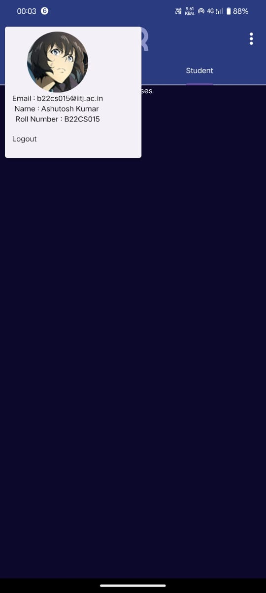
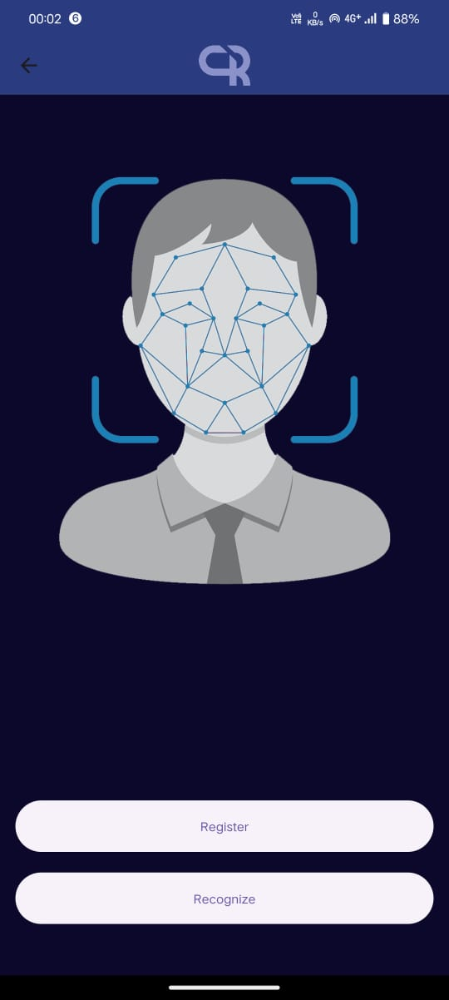
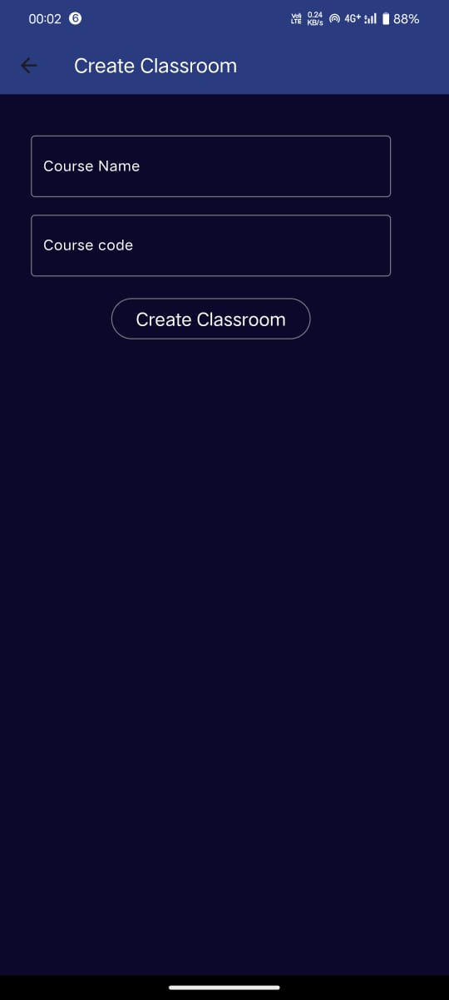

# Creal
A new Flutter project made for  Software Cource.

## Project Logo
<div align="center">
  
</div>

## App Download
Download the [APK file](https://drive.google.com/file/d/15gbXBYPlb4c4B8qN_WQiadFdSUTTnzQp/view) for Android.

## video
[video](https://www.youtube.com/watch?v=KlKf7AiV8WU)

## Screenshots
<div align="center">
  
  
  
  
  
</div>


## Installation

To install this project, follow these steps:
1. Clone the repository.
   ```sh
   git clone https://github.com/a19hu/Proxyproof-Creal_-.git

2. Navigate to the project directory.
   ```sh
   cd Proxyproof-Creal_-

3. Install the dependencies.
   ```sh
    flutter pub get

4. Run app.
   ```sh
   flutter run
